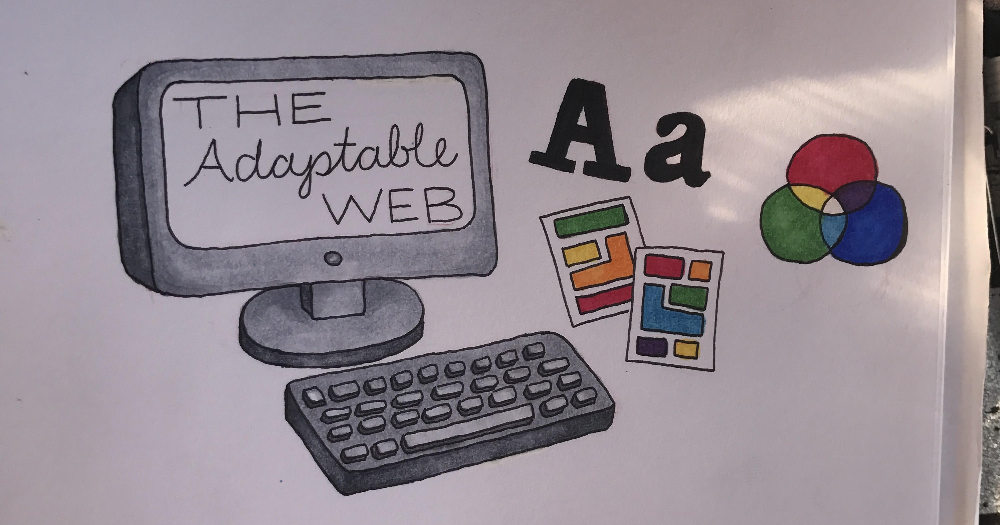
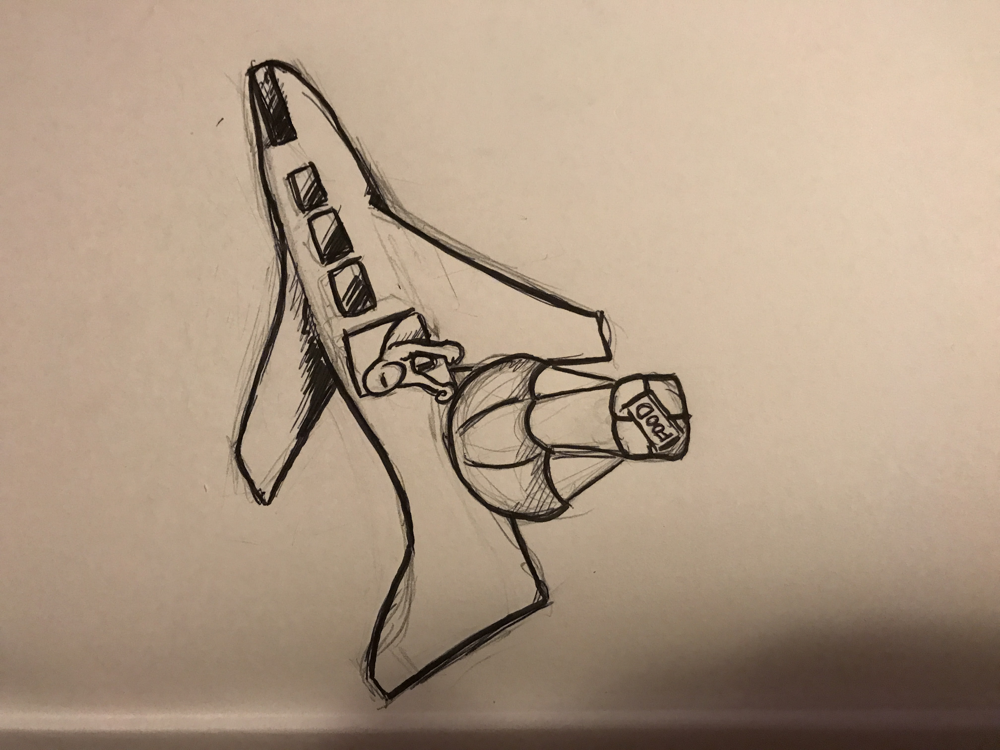
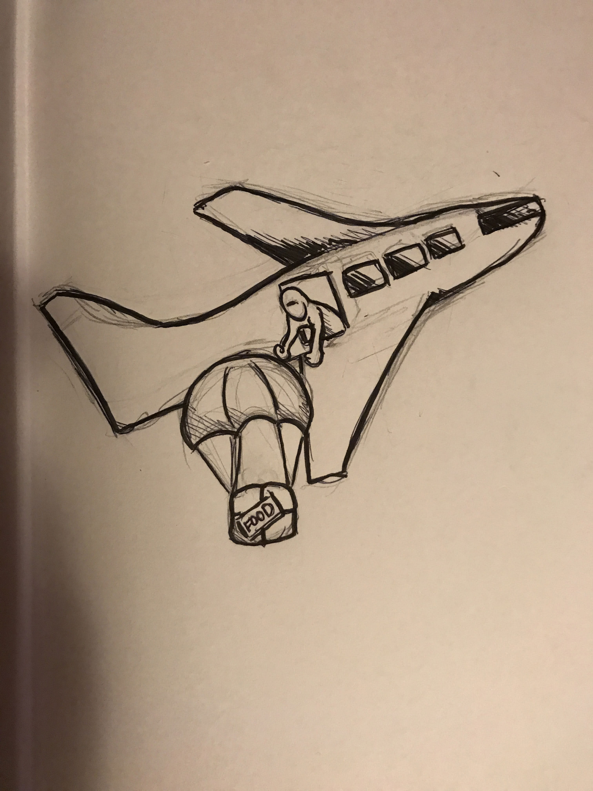

# Ebb & Flow
## Work in Progress

- [Draft](#draft)
- [Revision](#revision)
- [Best Practices](#best-practices)

- - -

# Draft

This is a paragraph.

## For Vincent

- - -

# Revision

- - -

## Best Practices

### Naming (Conventions) Things

- Use lowercase for naming files, folders, and in markup
- Use a hyphen (-) or an underscore (_) and not a space (%20) when separating phrases in naming files, folders, and in markup

### Project (Folder, Repo) Structure

#### For Example

- project-name
  - README.md
  - index.md
  - index.html
  - img/
